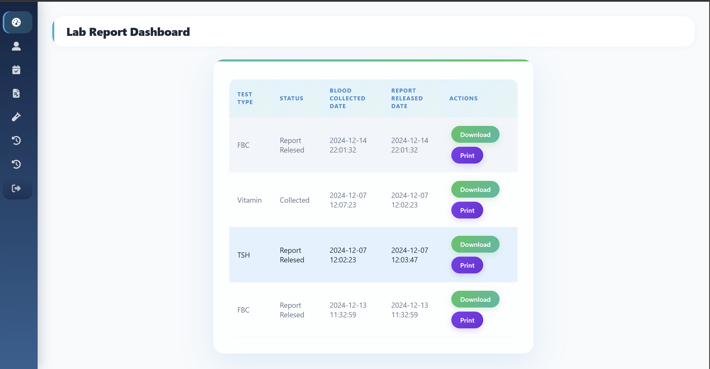
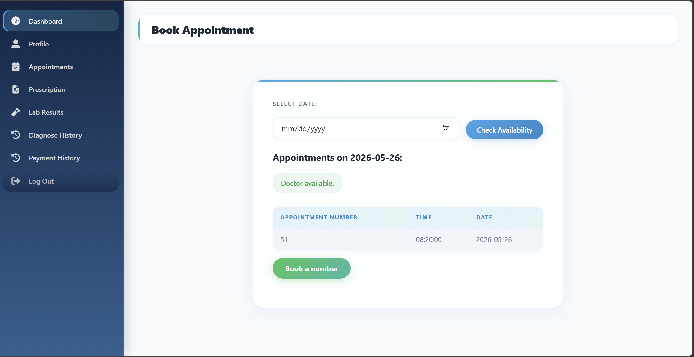

# 🏥 MediCare+ – Medical Centre Management System (Redesign Version)

> A modern web-based medical centre management system designed to digitalize and streamline patient services, supplier operations, and appointment workflows through a centralized healthcare platform.


---

##  Overview

**MediCare+** is a web-based medical centre management system developed to replace manual processes with a modern digital workflow.

The platform improves communication between **patients, suppliers, and the medical centre**, providing faster access to healthcare services and operational management through an intuitive web interface.

---

##  Key Features

###  Patient Portal
- Online patient registration
- Appointment booking with automatic appointment number generation
- View lab test status and download reports
- Access prescriptions
- Manage personal profile information

---

###  Supplier Portal
- Supplier registration and authentication
- Manage supplier profiles
- View and manage supply requests/orders

---

###  Public Services
- Access medical centre services online
- Digital communication with the medical centre

---

##  Technology Stack

| Layer | Technology |
|-------|------------|
| Frontend | HTML, CSS, JavaScript |
| Backend | PHP |
| Database | Microsoft SQL Server |
| Version Control | Git & GitHub |

---

##  Project Structure

```plaintext
clinic-web-app/
│
├── config/
│   └── db.php                  # Database connection configuration
│
├── css/                        # Stylesheets for frontend styling
│
├── images/                     # Graphic assets and images
│
├── js/                         # JavaScript files for dynamic interactions
│
├── pages/                      # Application views and pages
│   ├── patient/                # Patient portal specific pages
│   ├── supplier/               # Supplier portal specific pages
│   ├── about.html              # About Us page
│   ├── home-page.html          # Main landing/home page
│   ├── login-patient.html      # Patient login page
│   ├── login-supplier.html     # Supplier login page
│   ├── login.php               # Backend PHP logic for authentication
│   ├── service.html            # Medical center services page
│   ├── sign-up-patient.html    # Patient registration page
│   ├── sign-up-patient.php     # Backend patient registration processor
│   ├── sign-up-supplier.html   # Supplier registration page
│   └── sign-up-supplier.php    # Backend supplier registration processor
│
│
├── ui/                         # ui design
│
└── README.md                   # Project documentation
```


---







##  Improvements in This Version

- Redesigned modern user interface
- Better navigation and user experience
- Cleaner project architecture
- Optimized CSS and frontend components


---

##  Future Enhancements

- Online payment integration
- Email/SMS appointment reminders
- Doctor dashboard
- Patient medical history tracking
- Mobile application support

---


## 📄 License

This project was developed for **academic and educational purposes**.

---
